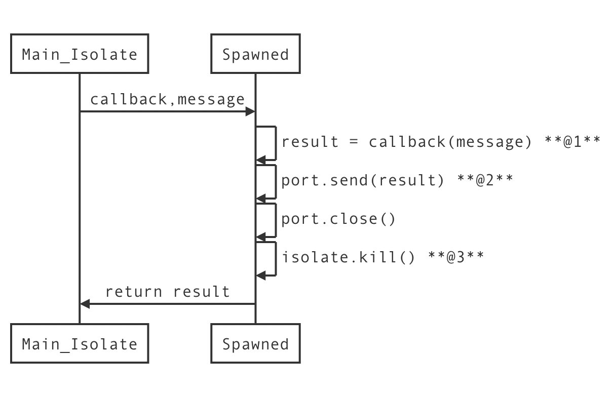

# 第一个方法 compute

在终端开发中，某些运算需要长期占用cpu运算，常见的做法是新起一个线程，而在 dart 中，类似的事情则需要使用到 `isolate` 了。最近在阅读别人代码时发现了一个方法：

```dart
/// Spawn an isolate, run `callback` on that isolate, passing it `message`, and
/// (eventually) return the value returned by `callback`.
///
/// This is useful for operations that take longer than a few milliseconds, and
/// which would therefore risk skipping frames. For tasks that will only take a
/// few milliseconds, consider [scheduleTask] instead.
///
/// {@template flutter.foundation.compute.types}
/// `Q` is the type of the message that kicks off the computation.
///
/// `R` is the type of the value returned.
/// {@endtemplate}
///
/// The `callback` argument must be a top-level function, not a closure or an
/// instance or static method of a class.
///
/// {@template flutter.foundation.compute.limitations}
/// There are limitations on the values that can be sent and received to and
/// from isolates. These limitations constrain the values of `Q` and `R` that
/// are possible. See the discussion at [SendPort.send].
/// {@endtemplate}
///
/// The `debugLabel` argument can be specified to provide a name to add to the
/// [Timeline]. This is useful when profiling an application.
Future<R> compute<Q, R>(ComputeCallback<Q, R> callback, Q message, { String debugLabel }) async {
    // .....
}
```

此方法注释简单翻译是：生成一个 isolate 来运行 callbak 并把其结果返回。由于callback的参数及计算结果是通过 isolate 传递，其类型会有所[限制](#port-limit) 。简单运用如下：

```dart
String syncFunc(int i){
    // 由于compute 方法指定callback必须要有一个参数
    // 所以无论如何都需要提供一个参数
    // 也只能提供一个。如果需要多个参数，或者无参数，看后文。
  return 'hello sync$i';
}
test2()async {
  var r1 = await compute(syncFunc,1);
  print("r1=$r1"); // r1=hello sync1
}

```

# compute 的问题

通常我们的运算会依赖其他计算，而且这些计算可能只提供了异步 api，于时调用变成：

```dart
Future<String> syncFunc(int i) async {
  await Future.delayed(Duration(seconds:1));// 模拟异步调用
  return 'hello sync$i';
}
test2()async {
  var r1 = await compute(syncFunc,1);
  print("r1=$r1"); // 此处无输出。
}
```

结果**没有输出!!!!**

# Why

这是什么原因？好在 dart 是开源的，我们可以从源代码一步步跟踪进去。

compute 方法如下：

```dart
Future<R> compute<Q, R>(ComputeCallback<Q, R> callback, Q message, { String debugLabel }) async {
  profile(() { debugLabel ??= callback.toString(); });
  final Flow flow = Flow.begin();
  Timeline.startSync('$debugLabel: start', flow: flow);
  final ReceivePort resultPort = ReceivePort();
  Timeline.finishSync();
  final Isolate isolate = await Isolate.spawn<_IsolateConfiguration<Q, R>>(
    _spawn,
    _IsolateConfiguration<Q, R>(
      callback,
      message,
      resultPort.sendPort,
      debugLabel,
      flow.id,
    ),
    errorsAreFatal: true,
    onExit: resultPort.sendPort,
  );
  final R result = await resultPort.first;
  Timeline.startSync('$debugLabel: end', flow: Flow.end(flow.id));
  resultPort.close();
  isolate.kill();
  Timeline.finishSync();
  return result;
}

@immutable
class _IsolateConfiguration<Q, R> {
  const _IsolateConfiguration(
    this.callback,
    this.message,
    this.resultPort,
    this.debugLabel,
    this.flowId,
  );
  final ComputeCallback<Q, R> callback;
  final Q message;
  final SendPort resultPort;
  final String debugLabel;
  final int flowId;

  R apply() => callback(message);
}

void _spawn<Q, R>(_IsolateConfiguration<Q, R> configuration) {
  R result;
  Timeline.timeSync(
    '${configuration.debugLabel}',
    () {
      result = configuration.apply();
    },
    flow: Flow.step(configuration.flowId),
  );
  Timeline.timeSync(
    '${configuration.debugLabel}: returning result',
    () { configuration.resultPort.send(result); },
    flow: Flow.step(configuration.flowId),
  );
}
```

主要做了以下几件事：

1. 生成一个isolate ,保存message 和callback
2. 在所生成的isolate 里运行callback，获取**callback 运行后**的结果并**通过Port.send 方法**传递其结果回给宿主isolate。

以面标粗的两个阶段：a) callback运行后 b) 通过port.send 就是问题所在。

因为我们的callback函数是异步的，那就意味着，直接运行是不会马上有结果的，只能返回一个 Future对象，不过这也没问题，有 Future 至少应该返回来对吧。**难道没办法传递 Future 对象?**

继续看源码

```dart
  /**
   * Sends an asynchronous [message] through this send port, to its
   * corresponding `ReceivePort`.
   *
   * The content of [message] can be: primitive values (null, num, bool, double,
   * String), instances of [SendPort], and lists and maps whose elements are any
   * of these. List and maps are also allowed to be cyclic.
   *
   * In the special circumstances when two isolates share the same code and are
   * running in the same process (e.g. isolates created via [Isolate.spawn]), it
   * is also possible to send object instances (which would be copied in the
   * process). This is currently only supported by the dartvm.  For now, the
   * dart2js compiler only supports the restricted messages described above.
   *
   * The send happens immediately and doesn't block.  The corresponding receive
   * port can receive the message as soon as its isolate's event loop is ready
   * to deliver it, independently of what the sending isolate is doing.
   */
  void send(var message);
```

# port-limit

根据注释描述，通过send发送的对象，仅支持若干平数据及内容为平数据的 map,list 。而在 dartVM 中，通过**相同的进程以 Isolate.spawn 来创建**的 isolate 可以发送共享的代码所生成的对象，此对象会**被复制一份**。

看来怀疑无法传递 Future 对象是错误的。重新回头看 compute 的代码：梳理下逻辑

```sequence
Main_Isolate->Spawned: callback,message
Spawned->Spawned: result = callback(message) **@1**
Spawned->Spawned: port.send(result) **@2**
Spawned->Spawned: port.close()
Spawned->Spawned: isolate.kill() **@3**
Spawned->Main_Isolate: return result
```

[](https://i.loli.net/2018/12/29/5c2741699a807.png)

Spawned isolate 里所运行的全是同步操作，所以，在@1 时可以返回一个 Future 对象，但到@3 时，此 Future 所依赖的上下文已经被销毁，这也许是它永远无法complete 的原因。实际原因需要进去看 engine 代码了。

# Isolate 的实现

这个问题先到这吧，因为我已经找到了解决的方法，先不去读难懂的 engine c++ 代码了 ;)

# 终极解决方案：IsolateRunner

\*\*官方提供的 [isolate 库(flutter only)](https://pub.dartlang.org/packages/isolate) \*\*

```dart
  final runner = await IsolateRunner.spawn();
  return runner
    .run(computeCallback, message)
    .whenComplete(() => runner.close());
```

封装一下：

```dart
typedef ComputeCallbackRunner<Q,R> = FutureOr<R> Function(Q message);

Future<R> computeRunner<Q,R>(ComputeCallbackRunner<Q,R> computeCallback,Q message) async {
  final runner = await IsolateRunner.spawn();
  return runner
    .run(computeCallback, message)
    .whenComplete(() => runner.close());
}
```

使用例子：

```dart
test() async {
  var r1 = await computeRunner(syncFunc,1);
  print("r1 = $r1");
  var r2 = await computeRunner(asyncFunc, 2);
  print("r2 = $r2");
}

String syncFunc(int i){
  return 'hello sync$i';
}
Future<String> asyncFunc(int i)async{
  await Future.delayed(Duration(milliseconds: 500));
  return 'helo async $i';
}
```

对了，使用前，别忘了在 `pubspec.yaml` 加上依赖

```yaml
dependencies:
  flutter:
    sdk: flutter
  isolate: ^2.0.2  # 添加这行

```
