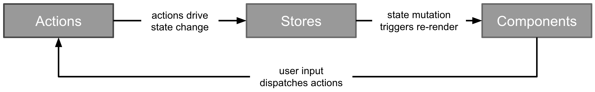

https://github.com/google/flutter\_flux

google 官方的一个 flutter 版本实现！



由于 flutter\_flux 基于 dart 版的 w\_flux ，先了解 w\_flux 吧：

https://github.com/Workiva/w\_flux

w\_flux 是单向数据流模式的一种实现，它包含三个模块：Action Store 和 FluxComponents 。

- Action 促使存于 Store 的数据发生变化
    
- Store 中数据的变化会触发 View 的重新渲染
    
- FluxComponents 响应用户行为派发 Action
    
- 如此这般循环
    

\*\*Action \*\*

Action 是一个可带有数据的命令，它可被派发也可被监听。

在 w\_flux 中，Action 是应用 State 变化的唯一驱动角色。FluxComponents 响应用户在界面上的操作派发 Action 。Store 监听这些被派发的 Action 然后根据此Action修改其内部数据。

**Store**

Store 是应用 state 的仓库和管理者。w\_flux 提供的基础类 Store ，可根据实际需求进行扩展。应用的 state 可能会被分散成许多互相独立的 store 中，这取决于应用的复杂程度及你所做的架构设计。

一般而言，Store 内的数据不能被直接修改。它仅在响应 Action 时才会被修改。所以 **Store 也应为只读**。公开数据只能通过 getter 获取。这个约束可以保证单向数据流的完整实现。

**FluxComponent**

FluxComponent 定义用户界面显示，它使用 Store 内的数据渲染。FluxComponent 监听 Store 并通过 trigger 进行有选择地进行重新渲染。

如果用户在 FluxComponent 上的行为意图个性应用 state ，那需要通过派发 Action 来达到目的。 FluxComponent **并不直接修改 Store**。

FluxComponent 扩展自 react-dart 的 [Component](https://github.com/cleandart/react-dart/blob/master/lib/react.dart#L10) （**好了，到此为止，flutter 并不需要 react**)

* * *

**Flutter\_flux 分界线**

flutter\_flux 基于 w\_flux ，但它不使用 React 而是直接使用 Flutter 自身一些特性。

> flutter 自身的 framework 里就有 State 的设计，可以很轻量地实现 flux （flutter\_flux 本身就三个不到200行的文件。远比其它 flux 实现要简单）

flutter\_flux 由三块组成：Action / Store / **StoreWatcher** . 与 w\_flux 不同的是没有了 Components 模块。

- Action 促使存于 Store 的数据发生变化
    
- Store 中数据的变化会触发 View 的重新渲染（触发逻辑在 StoreWatcher 中定义）
    
- Flutter widget 或其他可导致交互的来源（如网络push）响应用户行为派发 Action
    
- 如此这般循环
    

官方例程太长了，试着改写一个简单的，就用 flutter 的 increse 例子吧...

简化版，只放 State 代码：

```dart
class _IncreaseState extends State<Increase> {
  var _count = 0;
  @override
  Widget build(BuildContext context) {
    return GestureDetector(
      child: Center(child: Text('pressed $_count'),),
      onTap: (){
        setState(() {
          _count++;
        });
      },
    );
  }
}
```

数据只有一个 \_count ，因此添加一个 Store :

```dart
class CountStore extends Store{
  var _count = 0; // 这个就是要保存的 state（也就是数据） 了。
  int get count => _count; // 只能通过 getter 获取
}
```

还有一个 action ：screenTappedAction 。 Action 不需要继承类，只需要申明附带的数据类型的对象即可。

```dart
final Action<int> screenTappedAction = Action<int>();
```

接下来，需要让 Store 监听 Action，这部分工作可以在构造函数实现

```dart
class CountStore extends Store {
    ///...
    CountStore(){
        triggerOnAction(screenTappedAction, (payloadFromAction) {
          // 是否使用 payload 为业务逻辑，这里简单直接 _count++
          _count++;
        });
    }
}
```

triggerOnAction 为 Store 实现的方法(对应的还有其他内个 trigger )， triggerXXX 方法内部实现实际上是向 action 注册自己的 callback。

目前为止，一切绑定工作都已经完成。那如何触发action呢？在 facebook 的 flux 框架里，有一个全局唯一的角色 Dispatcher 来负责这件事，而在 flutter 里，不需要这样一个角色，我们可以像调用函数一样写： `aciton()` ，因为 action 是 Function 类型。

```dart
onTap: (){
    screenTappedAction(123);// payload 可自由决定
},
```

至此，整个数据流已经串起，就差一个显示了：

监听store变化：

```dart
class _IncreaseState extends State<Increase> 
    with StoreWatcherMixin<Increase> { // with StoreWatcherMixin 
    CountStore countStoreRef;// 仅为一个引用
    initState(){
        // 为什么不把 countStoreRef 直接引用到 countStore
        // 而要通过 listenToStore 来做个中介，待了解
        countStoreRef = listenToStore(StoreToken(countStore), (Store store) {
          setState(() {
            // do nothig here
          });
        });
    }
}
```

显示时使用 store 数据：

```dart
Text('pressed ${countStoreRef.count}');
```

全部代码如下：

```dart
import 'package:flutter/material.dart';
import 'package:flutter_flux/flutter_flux.dart';

void main() {
  runApp(MaterialApp(
    title: 'flux',
    home: Increase(),
  ));
  imageCache.maximumSize = 100;
}

class CountStore extends Store {
  var _count = 0; // 这个就是要保存的 state（也就是数据） 了。
  int get count => _count; // 只能通过 getter 获取
  CountStore() {
    triggerOnAction(screenTappedAction, (value) {
      print('payload from action $value');
      _count++;
    });
  }
}

final Action<int> screenTappedAction = Action<int>();

final CountStore countStore = CountStore();

class Increase extends StatefulWidget {
  Increase({Key key}) : super(key: key);
  _IncreaseState createState() => _IncreaseState();
}

class _IncreaseState extends State<Increase> with StoreWatcherMixin<Increase> {
  // with Mixin

  CountStore countStoreRef;// 仅为一个引用

  @override
  void initState() {
    super.initState();

    countStoreRef = listenToStore(StoreToken(countStore), (Store store) {
      setState(() {
        // do nothig here
      });
    });
  }

  @override
  Widget build(BuildContext context) {
    return GestureDetector(child: SafeArea(child: Material(
          child: Text(
            'pressed ${countStoreRef.count}',
          ))),
      onTap: () async {
        ///  Action 是 Function 的子类，因此可以直接调用
        /// 这也是利用 Dart 语言的特性
        screenTappedAction(123);
      },
    );
  }
}

```

**一个简单的 flux 模式至此就全部完成了！** 下篇写写在 flux 模式下，如何实现单元测试。
