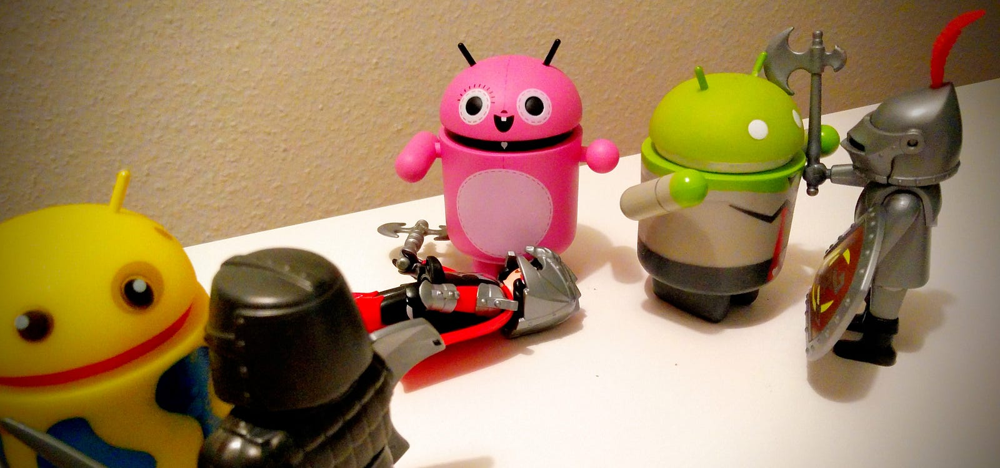

[Testing Android MVP](https://medium.com/@Miqubel/testing-android-mvp-aa0de6e165e4)

网上有成千上万的文章分析 Android 上各种架构模式的优缺点，然后让人失望的是它们都忽略了一点：测试

选择哪种模式通常取决于个人喜好和项目诉求。我不认为 MVVM 优于 MVP 或者说它是一个能完全满足用户需求的解决方案，当然，由于 MVVM 的简洁，在启动新项目时我会优先选择它。



### MVP 的四个要点( bullet point)

- MVP 指 Model-View-Presenter
- Model 是数据源。不管它是存于 DB,网络 还是本地内存
- View 是 Activity / Fragment 或自定义 View 。它应该只关心显示及处理用户交互
- Presenter 是个普通 Java 对象，它负责处理 View 和 Model 的通信，处理来自 Model 的数据转换，错误，并尽可能地减少 View 层的交互逻辑

### MVP 测试原则

- 首要原则 ：仅使用 **JUnit** 而非 Espresso 或其他自动化测试框架
- 其次：每一部分都单独测试，不使用集成测试。所以这个需要**依赖注入框架**相关技能。
- 因为使用 JUnit ，我们需要 Mock 所有 UI 组件。因此我们要用到 **Robolectric**
- 我们还需要熟练使用 **Mockito** ，因为我们要测试交互及 mock 类。

### 测试 Model

不管使不使用 MVP ,测试 Model 都应该是独立进行的事。在某些场景下，我们的 Model 是第三方库，因此我们无法进行测试。但我们应该能提供易于 mock 的接口。

- Model 不应引用任何Presenter 或 View 对象。
- Model 应提供易于 mock 的接口
- 不管用什么设计模式，Model 都应可独立测试

例：

以下Model提供用户资料(不管它是从网络还是DB)：

```kotlin
interface ProfileInterator{
  fun getProfile():Observable<UserProfile> 
}
```

```kotlin
class ProfileInteractorTest{
  val USER = "USERNAME"
  latinit var interactor:ProfileInteractor

  @Before
  fun setUp(){
    interactor = ProfileInteractorImpl(...)
  }

  @Test
  fun testGetUserProfile(){
    val subscriber = TestSubscriber<UserProfile>.create()
    interactor.getProfile().subscribe(subscriber)
    subscriber.apply{
      assertNoErrors()
      assertCompleted()
      assertThat(
        getOnNextEvents().get(0).getName()).equalTo(USER)
      )
    }
  }
}
```

> 译注：这个例子用了 RxJava 的 TestSubscriber，不使用框架怎么办？

### 测试View

测试View 会比我们所想的要简单，它最复杂的部分是 **Robolectric** 的使用，但在此之后一切都会非常简单。

考虑以下 View 接口：

```kotlin
interface ProfileView{
  fun display(userProfile:UserProfile)
}
```

具体的View 是一个自定义的 FrameLayout ：

```kotlin
class ProfileFrameLayout @JvmOverloads constructor(
  context: Context, 
  attrs: AttributeSet? = null) : Framelayout(
    context, attrs
    ),ProfileView{

  private lateinit var view:View

  lateinit var textUserName:TextView

  var presenter:ProfilePresenter? = null
    set(value){
        field = value
      value.attachView(this)
    }

  init {
    view = inflate(context,R.layout.view_profile,this)
    textUserName = findViewById(R.id.text_user_name)
    ButterKnife.bind(view)
  }

  override fun onAttachedToWindow(){
    super.onAttachedToWindow()
    presenter.attachView(this)
  }
  override fun onDetachedFromWindow(){
    super.onDetachedFromWindow()
    presenter.detachView()
  }
  override fun display(userProfile:UserProfile){
    textUserName.setText(userProfile.getName())
  }

}
```

> 译注：原文使用了 @Inject ，翻译成 kotlin 未加上

以上 View 层要测试什么？**所有内容**

- View 被正确创建
- 有正确的默认值
- 用户操作会触发 Presenter 的操作
- View 能正确实现其功能(显示用户信息)

具体测试代码(**讲解在代码后方**)

```kotlin
@RunWith(RobolectricGradleTestRunner::class.java)
@Config(constants = BuildConfig::class.java)
class ProfileFrameLayoutTest {
  private lateinit var profileView:ProfileFrameLayout

  @Mock
  lateinit var presenter:ProfilePresenter

  @Before
  fun setUp() {
    MockitoAnnotations.initMocks(this)
    profileView = ProfileFrameLayout(RuntimeEnvironment.application)
    profileView.setPresenter(presenter)
  }

  @Test
  fun testEmpty() {
    verify(presenter).attachView(profileView)
    assertThat(profileView.textUserName.text.toString().isEmpty())
  }

  @Test testLeaveView() {
    profileView.onDetachedFromWindow()
    verify(presenter).detachView()
  }

  @Test
  fun testReturnToView() {
    reset(presenter)
    profileView.onAttachedToWindow()
    verify(presenter).attachView(profileView)
  }

  @Test
  fun testDisplay() {
    val user = UserProfile(USER)
    profileView.display(user)
    assertThat(
      profileView.textUserName.text.toString()
    ).isEqualTo(USER)
  }

}
```

以上代码实现：

- 最顶上的注解是 Robolectric 的配置。告诉 JUnit 正在使用默认配置进行 Robolectric 测试
- 持有一个 view 引用进行测试
- Mock 一个 presenter ，我们只需要知道 presenter 的接口在正确的时间被正确地调用
- 持有一个 ProfileFrameLayout 对象，创建时使用 RuntimeEnviroment 的 application
- 给 View 设置了被 mock 的 presenter
- `几个 @Test 就不说了`

如此，我们的测试覆盖了 View 的所有代码。

#### 小结

- 提供 Mock 的 Presenter 来验证对应在的事件或交互发生时，presenter 有没调用对应接口
- 提供View 内部的对象(`译注：这需要打破封装，有没更好做法？`)以检查其状态和值
- 通过 Robolectric 创建View ，以移除Android 的依赖

### 测试 Presenter

我们用和测试 Model 相同的方法来测试 Presenter ，只需简单使用 JUnit 。不过这次我们需要提供一个 mock 的 View 来验证 Presenter 是否正确地与 View 进行通信。

```kotlin
class ProfilePresenter(interactor) {
  val interactor:ProfileInteractor = interactor

  private lateinit var view:ProfileView? = null

  fun attachView(view:ProfileVew) {
    this.view = view
    fetchAndDisplay()
  }

  fun detachView() {
    // 本例中不覆盖
    // 应该处理订阅
  }

  fun fetchAndDisplay() {
    // Not covered by this example:
    // You should handle the subscription
    // You should also check if view is not null
    // You should also handle the onError
    interactor.getUserProfile().subscribe{ profile ->
      view.display(profile)
    }
  }


}
```

上例程为文章简洁未处理很多 RxJava 相关的内容。

这里我们要测试的是：**Model 和 View 是否被正确地调用。不需要关注数据。(不过如果你的 Presenter 做了数据转换工作，那么还是要进行相应的测试的)**

还要测试的一个点是：**Presenter 如何处理 Model 的错误**,使用 RxJava 我们可以以在 getUserProfile 中返回一个 Observable.error(Throwable()) 的方式来进行。

> 译注：数据返回有两类：callback / event ，此例中用 RxJava Observable 本质上就是 Event 的方式。callback 的方式要做些修改

```kotlin
class ProfilePresenterTest {
  @Mock
  lateinit var interactor:ProfileInteractor
  @Mock
  lateinit var view:ProfileView

  @Before
  fun setUp() {
    MockitoAnnotations.initMocks(this)
    `when`(interactor.getUserProfile()).thenReturn(
        Observable.just(UserProfile())
    )

    presenter = ProfilePresenter(interactor)
    presenter.attachView(view)
  }
  @Test
  fun testDisplayCalled(){
    verify(interactor).getUserProfile()
    verify(view).display(any())
  }
}
```

#### 小结

- Mock Model 和 View 以便于验证被 Presenter 正确调用
- 根据不同场景 Model 返回假数据。甚至你不需要使用 RxJava

### 关键理念：

- 需要有可 Mock 的 Model ，如果没有，封装一层。
- 使用依赖注入框架来 mock presener.**不要在 View 里创建 Presenter**
- 不仅测试输出，还要测试交互
- 测试 View 的生命周期，如果你的 Presenter 与其有依赖 `译注：我们正在做的项目就强依赖生命周期`
- 测试View 的可视变化，不仅仅是文本，还应包括背景色等你需修改的部分。
- 测试 Presenter 如何处理不同的 Model 返回。

* * *

以下为需要学习的知识

- kotlin 默认为 final class ，需手动设置 open ，或引入 [allopen](https://kotlinlang.org/docs/reference/compiler-plugins.html)
- Robolectric
