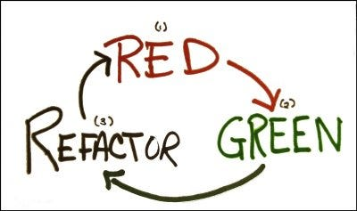
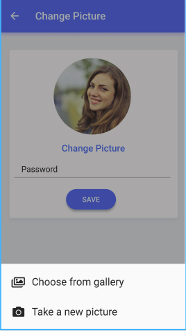

原文：https://medium.com/learnfazz/common-mistakes-in-tdd-and-tdd-in-flutter-2bf682071036

测试驱动开发（Test Driven Development） 简单写 TDD，指一种约定在写业务代码之前先写其测试代码的开发模式。

根据敏捷宣言作者之一 Robert Cecil Martin 的定义，TDD 有三条定律：[Clean Code —— TDD三定律及五原则](http://www.cuitalk.site/blog/20)

> 1. 在写出不能通过的单测代码前，不允许写产品逻辑代码
> 2. 只可编写**刚好无法通过**的单测代码，不能编译也算无法通过。
> 3. 只可编写**刚好足以通过**当前单测的产品逻辑代码

TDD 循环圈：



- Red: 写出不能通过的单测代码
- Green: 实现业务代码，使得单测代码通过
- Refector: 重构代码改善质量，但保证重构是能通过此前已经通过的代码。

常见的错误 TDD 做法：

- 先实现业务逻辑代码然后再写测试代码，并且仅提交测试代码。
- 在 Green 阶段，写出的代码不仅仅满足于通过测试。要记住，你**仅被允许写刚好足够通过测试的代码**。TDD 中，我们永远鼓励如婴儿般一步一步来，而非过度设计。
- 认为一次 R-G-R 循环等同于一个大特性的实现。错了！实现一个大我，需要很多循环。

* * *

TDD in Flutter

假设我们需要实现一个这样的功能：弹出提示窗提示用户选择相册或拍摄一张新图片：



在这个用例中，在开始写测试前，要先思考设计如何实现功能。假设我们想到这个函数来实现：`showImagePickerBottomSheet(BuildContext context)`。当函数被调用时，屏幕底部应该显示此弹出框且当用户点击其他区域时，弹出框应该隐藏。

让我们开始写第一个测试用例！第一个用例，我希望当函数被调用时，BottomSheet 组件会出现，且会有 "Choose from gallery" 和 "Take a new picture" 字样。

> 注：!!! 原文代码不见了!!! 尝试自己写。

```dart
import 'package:flutter/material.dart';
import 'package:flutter_test/flutter_test.dart';
import 'package:tdd_flutter/show_image_picker.dart';

void main() {
  testWidgets("click to show text", (tester) async {
    await tester.pumpWidget(Builder(builder: (BuildContext context) {
      return MaterialApp(
        builder: (context, child) {
          return showImagePickerBottomSheet(context);
        },
      );
    }));

    expect(find.byType(BottomSheet), findsOneWidget);
    expect(find.text(kChooseFromGallery), findsOneWidget);
    expect(find.text(kTakeANewPitcure), findsOneWidget);
  });
}
```

至此，我们的 RED 阶段已经完成，此时可以把测试代码提交了！

```shell
git add test/image_picker_test.dart
git commit -m "[RED] Make 'Bottom sheet should appear and show choose from gallery or take a new picture text' widget test"
```

接下来我们跳到 Green 阶段：

> 译注：！！同样，这篇文章的代码全不见了！！都是我自己撸的

```dart
import 'package:flutter/material.dart';
import 'package:flutter/widgets.dart';

Widget showImagePickerBottomSheet(BuildContext context) {
  return BottomSheet(
    builder: (context) {
      return Row(children: [
        Text("Choose from gallery"),
        Text("Take a new picture"),
      ]);
    },
    onClosing: () {},
  );
}
```

> 译注：在自己写的过程中，运行 fltter test 时，结果是未通过! 仔细看下日志，原来测试代码里写的 Picture 而实现代码写的是 picture！ 大小写错误。这个小插曲所反应的手抖bug在日常开发中也是比较常见的。更好的做法是把这两个串定义成常量。

接下来我们需要实现业务逻辑代码：

```dart
import 'package:flutter/material.dart';
import 'package:flutter/widgets.dart';

const kChooseFromGallery = "Choose from gallery";
const kTakeANewPitcure = "Take a new picture";
Widget showImagePickerBottomSheet(BuildContext context) {
  return BottomSheet(
    builder: (context) {
      return Row(children: [
        Text(kChooseFromGallery),
        Text(kTakeANewPitcure),
      ]);
    },
    onClosing: () {},
  );
}
```

\*\*注意！我们不能在此时添加 icon！ \*\*此时所有测试都通过了，可以提交了：

```shell
git add lib/show_image_picker.dart
git commit -m "[GREEN] Implement image_picker_bottom_sheet just enough to make 'bottom sheet image picker to appear and show bottom sheet widgets' widget test pass"
```

我认为，如果我们的实现是正确的，那 Refactor 阶段是可选项。

> 译注：原文没给代码，实际上本人对 flutter 熟悉程度一般，实现代码是需要重构的，BottomSheeet 的注释提示，BottomSheet 一般由 ScofoldState.showBottomSheet 来调用而非直接调用构造函数。不过，先不节外生支，按原文节奏。https://medium.com/flutter-community/flutter-beginners-guide-to-using-the-bottom-sheet-b8025573c433
