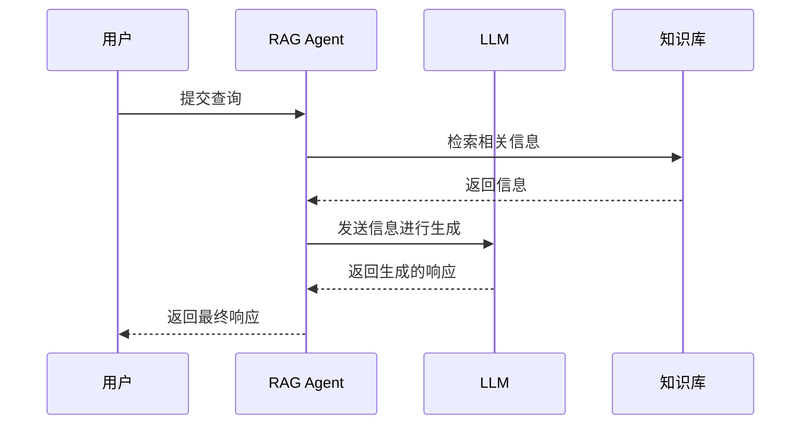

 > 纸上得来终觉浅，绝知此事要躬行
 
RAG(Retrieval-Augmented Generation 检索增强生成) 技术 2020 年由 Meta 提出，其基本工作原理为：通过信息检索获取相关内容然后再让大模型针对内容和所问问题进行回答，以期提升回答准确度。它主要规避的是：大模型知识库过时，私域知识缺失和幻觉问题。

## LLM 知识是静态的

在我上一篇科普：什么是 Agent 中，介绍过 LLM 的基本原理，我们可以知道 LLM 只是一个输入输出程序。而在知道 RAG 是什么之前还需要知道另一个事实，**指定版本的LLM 的知识是固定的静态**的，在训练完毕的一个版本的 LLM 中，它内存的知识已经固化。这意味着，它的知识可能是过时的，它也不知道现在是什么时间，无法知道他训练的知识以后发生的事，另外，他也无法知道你们公司未暴露到外网的的内部知识库（即私域知识）。但 LLM 是概率性生成工具，它有可能会根据内部总结的规律来生成一个似是而非的回答，此即所谓“幻觉”。

## 告诉你答案你来回答我

即然 LLM 不知道答案，那我就告诉你答案，让你回答。这句话有点难理解，*既然我都知道答案了，为什么还要问你*。答案是，这里的“我”是 Agent。Agent 掌握了你公司的内部知识库，它能根据你的问题去搜索知识库相关内容，但传统的检索工具搜索出来的相关数据片段可读性很差，这时需要向 LLM 发送问题时附带上这些相关知识，让 LLM 做出总结来回答。流程如下：

## 检索是传统的关键字搜索吗

传统的关键字搜索是基于词汇匹配的，而 RAG 中的检索通常使用更先进的方法，如向量搜索。向量搜索将文本转换为高维向量，并通过计算向量之间的相似性来找到相关内容。这种方法能够更好地理解语义，从而提高检索的准确性。
