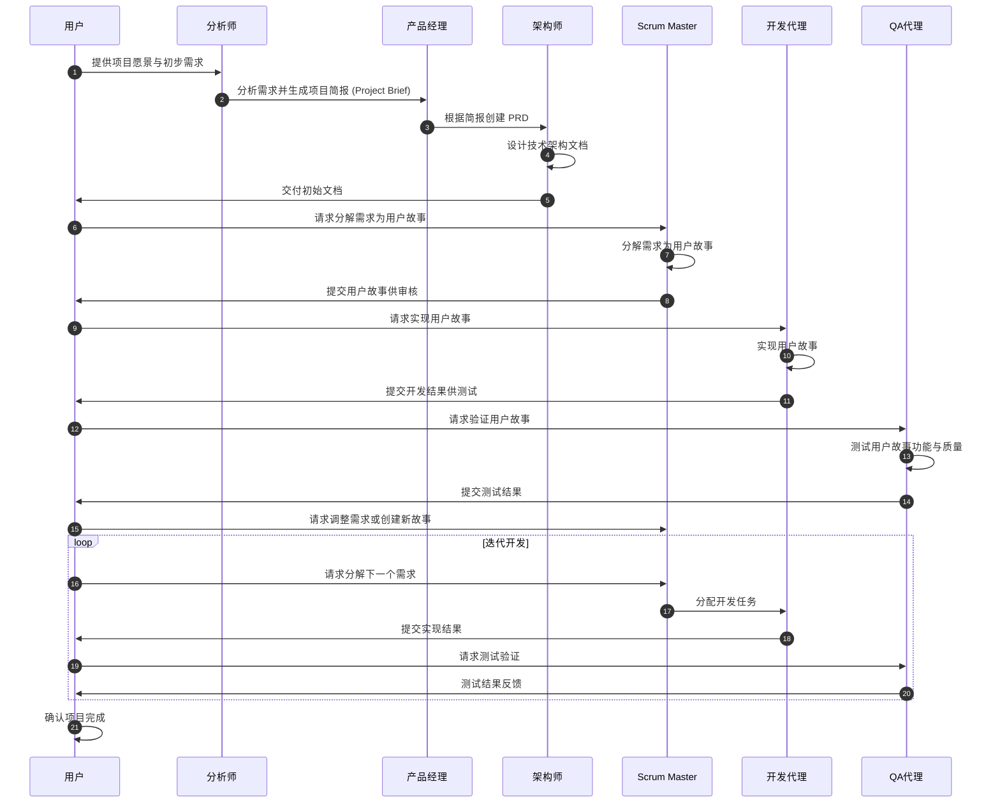

BMAD MTHOD (Breakthrough Method of Agile AI-Driven Development)是一个开源的 AI 驱动敏捷开发方法。

BMAD 通过给 LLM 指定人设和工作流，设定敏捷方法中的各种角色完成任务。
BMAD 官方宣称通过生成**一致**的需求文档和架构文档 **消除了规划不一致和上下文丢失——AI 辅助开发中的最大问题**。

若干年前，考了 PMP 后，曾经报了 ACP，后来因疫情等种种原因（懒）没去上课，后来考证也没再去了，好在现在有 AI ，学习效率也大大提升了（除了可能有幻觉导致理解错误外），这系列文章也算是补个课吧。（大多数内容来自 LLM 的回答，少部分基于个人理解的输出，仅作个人笔记）

**项目管理中，不管是工具还是流程甚至角色，都是要按项目实际需要进行裁剪的，因此，BMAD 所提供的角色和工作流根据你的目标来决定，都可以是可选项**

## Scrum

区别于瀑布开发流程， Scrum 设计用于迭代式和增量式开发，以短周期开发(Sprit)为核心，强调团队协作、自组织和持续改进。尤其适用于需求多变、不确定性高的项目。

> 团队协作，自组织和持续改进这三个特点并非敏捷所特有，但敏捷中将其具体化和系统化，表现为：
> 1. 透明性：团队信息共享，彼此了解当前进展与问题（站会，看板）(**BMAD 通过共同的文档上下文达成信息共享信息**)
> 2. 互相支持：在信息共享中共同攻克困难(**BMAD 通过共同的文档上下文达成信息共享，但 BAMD 中角色人设是固定的，基本不存在需要角色互助的情况**)
> 3. 跨职能：技能互补，每个成员都能承担多种职责，减少对外部资源的依赖 **（ BMAD 把个人职能限定冲突）**
> 4. 持续改进：频繁与利益相关者展示进展，及时修正确保交付符合需求。通过 Sprint 回顾和用户反馈驱动改进。（**BMAD 并不能帮你做这件事，这需要你(也就是唯一的利益相关人，持续地去观察并给出反馈，sprint 回顾会也需要你自己触发， BAMD 中只有 epic 回顾会)**
> 5. 自组织：团队在没有外部强制管理的情况下，能自主规划和执行任务，成员对整个目标负责，领导偏向支持型。（**BMAD 必须由人类——此时相当于项目经理来驱动**）
> 6. 自组织：Scrum Master 负责移除障碍，引导团队高效运转。（[[#在 AI 编程中，会遇到哪些障碍需要 ScrumMaster 解决]]，应如何引导促进解决？又或者说，人类才应该是 scrum master?**)
> 7. 自组织：团队自行选择如何分配和拆解任务，不依赖项目经理指挥（**BMAD 团队成员并不多，基本可以确定由谁来分解任务，但也许应根据项目特点来设立不同的角色，比如后台开发，甚至具体到某个技术栈的后台开发**）

## BMAD 中的 Scrum

**尽管定义了不同的角色，但 BMAD 并不是一个真正的敏捷团队，依然需要人类来触发各种指令，你需要当这个触发期，有时你是利益相关方，有时是项目经理，有时是 scrum master，在适当的时候踢一脚，更多时候，你是 scrum master ，需要知道当前是什么状态，需要由谁来进行哪项工作**

### 在 AI 编程中，会遇到哪些障碍需要 ScrumMaster 解决

#### **需要解决的问题**

1. **上下文传递**：
    - 确保开发代理（Dev Agent）具备完整的背景信息，包括用户需求、技术约束和测试要求。
2. **任务拆分**：
    - 将复杂的需求分解为小型、可交付的开发故事，便于 AI 开发代理逐步实现。
3. **质量控制**：
    - 验证代码实现是否满足需求，并通过持续反馈提升质量。
4. **开发节奏的管理**：
    - 确保开发团队或 AI 代理保持稳定的交付节奏，避免过载或任务堆积。

#### **可能遇到的障碍**

1. **AI 理解局限**：
    - AI 代理可能难以理解模糊或复杂的需求，Scrum Master 需要确保需求的清晰性。
2. **缺乏灵活性**：
    - AI 编程代理通常缺乏灵活性，可能无法处理需求变更或异常情况。
3. **依赖人类干预**：
    - 当需求不明确或技术设计存在问题时，Scrum Master 可能需要依赖人类团队的指导。

