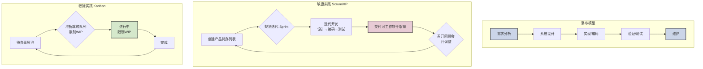

## 传统软件工程

*先用大模型复习一下软件工程*

经典的‘瀑布模型’和现代的‘敏捷开发’是软件工程中两种具有代表性的过程模型（或方法论）。

“瀑布模型”是应对“软件危机”的一剂猛药。它试图用**严格的阶段化、文档化和流程控制**，来解决软件开发中的**混乱、不可预测和质量低下**的问题。虽然它后来因为过于僵化、难以适应需求变化而受到批评，并催生了“敏捷开发”等更灵活的方法，敏捷开发将软件研发视为一个**不断探索、学习和适应的过程**，而不是一个按图纸施工的流水线。

### 不同开发模型的流程

### 不同模型在不同问题域处理

| 对比维度        | 瀑布模型                                    | Scrum                                    | Kanban                            | XP                                        |
| ----------- | --------------------------------------- | ---------------------------------------- | --------------------------------- | ----------------------------------------- |
| **核心哲学**    | 计划驱动   预见性过程                         | 经验性过程   在复杂环境中探索                      | 流动式过程   可视化与限制在制品              | 技术卓越   响应变化的工程实践                       |
| **开发模式**    | **顺序式**   （线性序列）   需求→设计→编码→测试→交付 | **迭代式**   （固定时长周期）   按优先级分Sprint交付 | **流式**   （持续流动）   任务按需从看板拉取 | **迭代式**   （短周期，通常1-2周）   严格遵循完整工程实践 |
| **变更处理**    | ❌ **抗拒变更**   变更代价高昂，需严格流程控制          | ✅ **在每个Sprint开始时接纳**   Sprint进行中受保护   | ✅ **随时可接纳**   通过优先级调整看板任务      | ✅ **在迭代中积极拥抱**   通过持续集成和重构支持           |
| **交付频率**    | **低频**   项目末期一次性交付                   | **固定频率**   每个Sprint结束时交付可用的增量         | **持续交付**   单个功能完成后即可交付         | **高频**   每次集成都可视为一次小交付                 |
| **客户/用户参与** | **首尾参与**   初期定义需求，末期验收               | **深度参与**   PO全程代表用户，参与评审会             | **按需参与**   协助定义任务和验收条件         | **极致参与**   现场客户是核心实践之一                 |
| **度量焦点**    | 遵循计划的程度   （进度、预算）                    | **速度**   （每个Sprint完成的工作量）             | **前置时间/周期时间**   （任务从开始到完成的总时间） | **软件质量**   （测试覆盖率、代码复杂度等）              |
| **文档要求**    | **重型文档**   详尽的规格说明和设计文档              | **轻型文档**   “刚好够用”，用户故事是核心             | **极简文档**   看板卡片作为信息载体          | **代码即设计**   强调代码可读性，文档最少化              |
| **适用场景**    | 需求明确、稳定   技术成熟   大型安全关键系统         | 需求快速变化   创新性、探索性项目                    | 维护和运营类工作   突发任务多的支持团队          | 需求易变性强   对质量和技术要求极高的项目                 |
### 总结 

**瀑布模型**的核心是**计划和控制**，试图通过前期完美的规划来规避风险。
**敏捷实践**的核心是**适应和响应**，通过短周期、高频率的反馈循环来拥抱变化和管理不确定性。
    - **Scrum** 提供了**结构化的迭代框架**。
    - **Kanban** 专注于**可视化流程和优化流量**。
    - **XP** 则强调了实现敏捷所需的**具体工程技术**。

它们并非完全对立，而是适用于不同上下文的方法论。在现代软件开发中，团队也常常混合使用这些实践，形成适合自身的“混合模式”。

### 实践

尽管各种方法/理论很多，但在实践中其实不会严格遵守。在响应变更和工程僵化之间如何平衡是敏捷最大的难题，事实上，几乎所有管理都有这个问题，松驰有度的度是无法量化的。

## AI 是什么

> 给 AI 以自由还是更多的人工决策，这是个问题

在编程的世界里，AI 是什么？这里并不是说我们赋予它的角色或人设(persona)。

它有丰富的知识，不管是广度还是深度，都远比人类工程师**平均**水平要高，同时，它又深受错误知道的困扰，在错误知识上的广度和深度，同样比人类工程师平均水平要高。

## 多角色协同

从产品概念到最终产品形态，“古法”软件工程理论有两种方法：“瀑布流开发”，“敏捷开发”

第一步就是现实世界有 figma 设计稿，你不能直接让 AI 自由发挥而要根据设计稿来还原。

> 设计根据交互理解画出设计稿，开发再从设计稿实现，这种路径也许是错的，可能直接由产品说明书交互说明，产生初稿，设计再和开发共同调整 UI 表现会更合适也更高效。这相当于给了设计师更多想象空间，因为如果每个想法都要画出来是要时间的。设计稿是一个由产品意图到最终用户产品的中间产物。它有大量的冗余信息，应该由 AI 进行抽象，把必要的信息保留（如，主题，风格）。

## 会话间必要上下文共享

## 并行开发?

