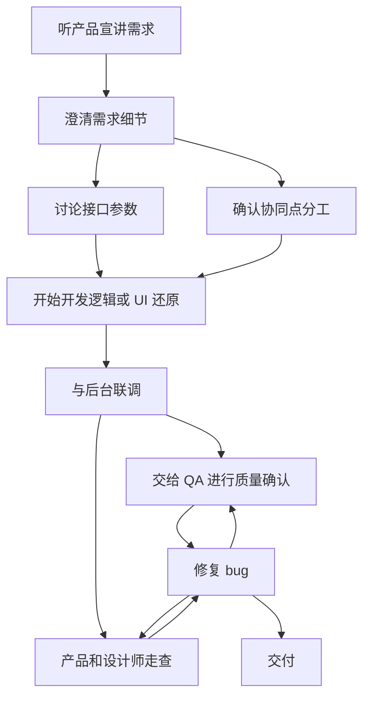

> TLDR;
> (sub)agent/chatmode/rule/slash command 名称虽多，但大同小异，都是通过定义工作流让将 AI 约束在固定的路径上去生成我们所需要的文档、代码、执行指定的命令，以完成我们所想完成的工作。

## 梳理你的工作流

工作流，即你完成工作的每一步动作，比如，一个客户端开发的工作流：你需要先听产品宣讲需求，并在宣讲过程中要求产品澄清需求中的每个细节（如，错误情况怎么处理，加载重试策略是怎样的），然后你还可以和后台同学讨论接口的参数，和协作的客户端同学确认协同点的分工，准备就绪后就开始开发逻辑或进行 UI 细节还原，最后与后台“联调”，然后交给 QA 进行质量确认，修复 bug，这过程中产品和设计师会对我们的实现进行走查。画成图如下：

