昨天去看了看所谓的共享办公室，一个小货仓能仅容 3 人的小房间要价 1800（说还可以谈），在那么小的空间里打代码？还是算了吧。


## 少儿编程
```
实现一套 AI 时代的少儿编程工具。
针对少儿的心智特点与知识掌握程度设计工具
使用 AI 来厘清和约束使用者的实际需求
使得其真实需求能在固定的技术栈内被满足，使用指定的技术栈来确保生成的可控

如，少儿可能识字不全，语音输入必须有，少儿可能知识面不够，需要额外深入分析或设计专有人设的 AI. 用少儿能懂的语言沟通等

初步设想备选工具为 flutter / jetpack compose / web 三种，考虑从能力范围，技术可控（少儿不可能去 debug 找错误）等方面分析 
```

---

## BMAD 实战


官方使用说明视频： https://www.youtube.com/watch?v=LorEJPrALcg

BMAD 基于这样一个工作流设计：

1. 项目想法
2. 分析研究（可选）：头脑风暴 -> 市场调研 -> 竞品分析 -> 创建项目简报
3. 

### 安装
```
npx bmad-method install
```
- 项目类型选 `BMad Agile Core System`

- Will the PRD (Product Requirements Document) be sharded into multiple files?
**Y** *我估计我的项目会比较大，需求拆分到不同文件也许更有利于上下文理解*

- Will the architecture documentation be sharded into multiple files?
**N** *架构应该是尽可能简单的，拆分并不能让上下文更短，反而可能会丢失必要的架构指引*

此时 BMAD 给我一个提示：
```
⚠️  IMPORTANT: Architecture Sharding Disabled
With architecture sharding disabled, you should still create the files listed
in devLoadAlwaysFiles (like coding-standards.md, tech-stack.md, source-tree.md)
as these are used by the dev agent at runtime.

Alternatively, you can remove these files from the devLoadAlwaysFiles list
in your core-config.yaml after installation.
```
大意是，我仍需创建 `coding-standards.md`, `tech-stack.md`, `source-tree.md` 这几个在 `devLoadAlwaysFiles` 中，由 `dev` 在运行时会用到的文件，又或者从 `devLoadAlwaysFiles` 中删除这些文件。这是什么意思？我也不知道，**后面再看**。

- IDE，可多选，但我不建议过多，会污染空间，比如 augment 可能会去读到写到 claudecode 目录的文件
我选 **Github Copilot** 和 **iFlow cli**

最终会将 prompt 模板按你所选的 IDE 的格式生成到你的目标目录上，我选了 github copilot 和 iflow cli ，效果如下：

![[Pasted image 20251010161052.png]]

在 Github Copilot 中，表现如下，你可以通过设定的人设进行对话。

![[Pasted image 20251010160955.png]]

 而在 `iflow cli` 中，则以 slash command 的方式出现:
 ![[Pasted image 20251010161146.png]]
其他 IDE/cli 都类似

### 使用

```mermaid
graph TD
    A["Start: Project Idea"] --> B{"Optional: Analyst Research"}
    B -->|Yes| C["Analyst: Brainstorming (Optional)"]
    B -->|No| G{"Project Brief Available?"}
    C --> C2["Analyst: Market Research (Optional)"]
    C2 --> C3["Analyst: Competitor Analysis (Optional)"]
    C3 --> D["Analyst: Create Project Brief"]
    D --> G
    G -->|Yes| E["PM: Create PRD from Brief (Fast Track)"]
    G -->|No| E2["PM: Interactive PRD Creation (More Questions)"]
    E --> F["PRD Created with FRs, NFRs, Epics & Stories"]
    E2 --> F
    F --> F2{"UX Required?"}
    F2 -->|Yes| F3["UX Expert: Create Front End Spec"]
    F2 -->|No| H["Architect: Create Architecture from PRD"]
    F3 --> F4["UX Expert: Generate UI Prompt for Lovable/V0 (Optional)"]
    F4 --> H2["Architect: Create Architecture from PRD + UX Spec"]
    H --> Q{"Early Test Strategy? (Optional)"}
    H2 --> Q
    Q -->|Yes| R["QA: Early Test Architecture Input on High-Risk Areas"]
    Q -->|No| I
    R --> I["PO: Run Master Checklist"]
    I --> J{"Documents Aligned?"}
    J -->|Yes| K["Planning Complete"]
    J -->|No| L["PO: Update Epics & Stories"]
    L --> M["Update PRD/Architecture as needed"]
    M --> I
    K --> N["📁 Switch to IDE (If in a Web Agent Platform)"]
    N --> O["PO: Shard Documents"]
    O --> P["Ready for SM/Dev Cycle"]

    style A fill:#f5f5f5,color:#000
    style B fill:#e3f2fd,color:#000
    style C fill:#e8f5e9,color:#000
    style C2 fill:#e8f5e9,color:#000
    style C3 fill:#e8f5e9,color:#000
    style D fill:#e8f5e9,color:#000
    style E fill:#fff3e0,color:#000
    style E2 fill:#fff3e0,color:#000
    style F fill:#fff3e0,color:#000
    style F2 fill:#e3f2fd,color:#000
    style F3 fill:#e1f5fe,color:#000
    style F4 fill:#e1f5fe,color:#000
    style G fill:#e3f2fd,color:#000
    style H fill:#f3e5f5,color:#000
    style H2 fill:#f3e5f5,color:#000
    style Q fill:#e3f2fd,color:#000
    style R fill:#ffd54f,color:#000
    style I fill:#f9ab00,color:#fff
    style J fill:#e3f2fd,color:#000
    style K fill:#34a853,color:#fff
    style L fill:#f9ab00,color:#fff
    style M fill:#fff3e0,color:#000
    style N fill:#1a73e8,color:#fff
    style O fill:#f9ab00,color:#fff
    style P fill:#34a853,color:#fff

```



---

这个开源仓库有说细说明，英文好的，或想进一步详细了解的，建议还是看源码